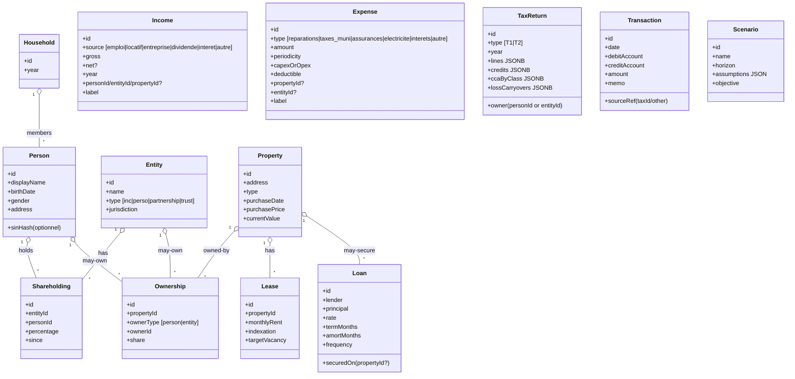

# ADR-0002 — Modèle de Données Canonique (MDC) et Graphe d’événements

Statut: accepté
Date: 2025-10-29
Auteur: Simon (avec appui IA)

## Contexte

Aujourd’hui, l’application ne propage pas systématiquement les changements (ex.: import impôts) vers les autres modules (compta, prévisions, décideur). Les causes: absence de MDC central, ETL partiel, pas de bus d’événements ni DAG de recalcul, invariants peu formalisés.

## Décision

1) Instituer un Modèle de Données Canonique (MDC) unique comme source de vérité.
2) Mettre en place un pipeline ETL (Extract→Transform→Load) pour les entrées fiscales/comptables/immobilières.
3) Introduire un bus d’événements et un graphe de dépendances (DAG) pour orchestrer les recalculs en ordre topologique avec mémoïsation.
4) Définir des invariants et référentiels (plan de comptes, classes CCA, mapping fiscal→comptable) testés.

## Périmètre du MDC (entités principales)



Notes:
- Les associations `Shareholding` et `Ownership` explicitent les multi‑propriétés et co‑détentions.
- `Income`/`Expense` peuvent pointer vers `personId`, `entityId`, `propertyId` selon leur nature.
- `Transaction` représente les écritures double‑partie (équilibre obligatoire).

## Référentiels et mapping fiscal→comptable

- Plan de comptes (IFRS/ASPE simplifié) versionné.
- Classes CCA (ex.: classe 1, 8, 10, 13) avec plafonds et règles.
- Table `map_ligne_fiscale_to_compte` couvrant T776/T1/T2 principaux.

Exemples:
- T776.RevenuBrut → 5110 Revenu locatif brut
- T776.DépensesIntérêt → 7510 Intérêts (déductible)
- T776.TaxesMuni → 6120 Taxes municipales
- CCA.Classe1 → Amortissement immobilisations (non‑cash)

## Bus d’événements et DAG de recalcul

```mermaid
flowchart LR
  subgraph Inputs
    A[Upload PDF Impôts / Relevés / Loyers]
  end
  A --> E1[ETL Extract]
  E1 --> E2[ETL Transform\n(normaliser, mapper, CCA, intérêts/capital)]
  E2 --> E3[ETL Load\n(MDC + Transactions)]
  E3 -->|emit TaxReturn.Updated(year, owner)| EV1[(Bus d'événements)]

  subgraph Recalcul
    C1[Compta agrégée]
    P1[Prévisions]
    I1[Immobilier KPIs\n(NOI, DSCR, Cap rate)]
    D1[Décideur\n(perso vs inc, ROC/billets, refinance)]
  end

  EV1 --> C1 --> P1 --> D1
  EV1 --> I1 --> C1
```

Exécution:
- Orchestrateur calcule l’ordre topologique, mémoïse par hash(inputs), ne recalcule que les nœuds impactés.
- Chaque nœud publie `Node.Updated` à la fin, alimentant potentiellement d’autres recalculs.

## Invariants (extraits)

- Écritures: somme débits = somme crédits.
- Revenu locatif = Σ loyers – vacance – incitatifs.
- Intérêts = f(échéancier prêt).
- CCA ≤ plafond par classe et base non amortie.
- Traçabilité: chaque KPI référencé par (tax_id/txn_id).

## Responsabilités par module

- Fiscalité: import T1/T2/RL/T4/T5, extraction, normalisation, CCA, crédits.
- Compta: plan de comptes, écritures double‑partie, agrégations P&L/bilan/flux.
- Immobilier: propriétés, baux, dépenses CAPEX/OPEX, KPIs (NOI, DSCR, cap rate).
- Prévisions: projections 1–3 ans (hypothèses taux, inflation, vacance, loyers).
- Décideur: scénarios prudent/base/optimiste, recommandations (incorporation, ROC/billets, refinance, vente/conserver).

## Impacts et risques

- Complexité accrue: nécessite seeds et tests robustes.
- Orchestration: éviter boucles/doubles déclenchements.
- Performance: cache/mémoïsation obligatoires sur nœuds coûteux.

## Plan d’adoption (liens avec la feuille de route)

- Item #2/#3: Étendre Prisma pour matérialiser le MDC (base puis finances).
- Item #4/#5: Référentiels et mapping.
- Item #6–#8: ETL complet.
- Item #9–#11: Bus + événements + DAG.
- Item #12–#14: KPIs, prévisions, comparatifs MVP.

## Critères d’acceptation (pour cet ADR)

- Ce document est versionné dans `docs/adr/0002-mdc-and-event-graph.md`.
- Les diagrammes Mermaid rendent correctement dans l’éditeur/CI.
- Les entités listées couvrent le MVP et cadrent les items #2–#14.
